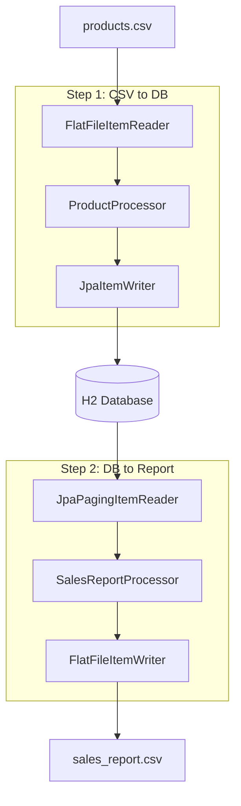
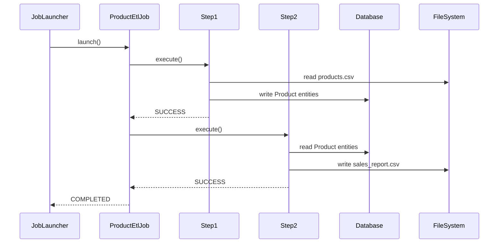

# Design Document

## Overview

This design implements a Spring Batch ETL pipeline using a multi-step job architecture. The system follows the standard Spring Batch pattern with ItemReader, ItemProcessor, and ItemWriter components for each step. The design emphasizes separation of concerns, proper error handling, and demonstrates both file-based and database-based batch processing patterns.

## Architecture

### High-Level Architecture



### Job Flow



## Components and Interfaces

### Data Models

#### Product Entity
```java
@Entity
@Table(name = "PRODUCTS")
public class Product {
    @Id
    private Long id;
    private String name;
    private String description;
    private BigDecimal price;
    private LocalDateTime importDate;
}
```

#### SalesReport DTO
```java
public class SalesReport {
    private Long productId;
    private String productName;
    private BigDecimal price;
}
```

### Step 1 Components

#### ProductCsvReader
- **Type**: FlatFileItemReader<Product>
- **Responsibility**: Read CSV file and map to Product objects
- **Configuration**: 
  - Resource: classpath:products.csv
  - LineMapper: DelimitedLineTokenizer with BeanWrapperFieldSetMapper

#### ProductProcessor
- **Type**: ItemProcessor<Product, Product>
- **Responsibility**: Add importDate and perform data validation
- **Logic**: Set importDate to current timestamp, validate required fields

#### ProductWriter
- **Type**: JpaItemWriter<Product>
- **Responsibility**: Persist Product entities to database
- **Configuration**: EntityManagerFactory injection for JPA operations

### Step 2 Components

#### ProductReader
- **Type**: JpaPagingItemReader<Product>
- **Responsibility**: Read Product entities from database with pagination
- **Configuration**: 
  - Query: "SELECT p FROM Product p ORDER BY p.id"
  - Page size: 100

#### SalesReportProcessor
- **Type**: ItemProcessor<Product, SalesReport>
- **Responsibility**: Filter products by price > 50 and transform to SalesReport
- **Logic**: Return null for products with price <= 50 (filtered out)

#### SalesReportWriter
- **Type**: FlatFileItemWriter<SalesReport>
- **Responsibility**: Write SalesReport objects to CSV file
- **Configuration**: 
  - Resource: file:sales_report.csv
  - LineAggregator: DelimitedLineAggregator with custom field extraction

### Job Configuration

#### ProductEtlJobConfig
- **Responsibility**: Define job and step beans
- **Components**:
  - Job: productEtlJob with step1 → step2 flow
  - Step1: Chunk-oriented step with reader, processor, writer
  - Step2: Chunk-oriented step with reader, processor, writer
  - Chunk size: 10 items per transaction

## Data Models

### Database Schema
```sql
CREATE TABLE PRODUCTS (
    id BIGINT PRIMARY KEY,
    name VARCHAR(255) NOT NULL,
    description TEXT,
    price DECIMAL(10,2) NOT NULL,
    import_date TIMESTAMP
);
```

### CSV Formats

#### Input CSV (products.csv)
```
id,name,description,price
1,Laptop,High-performance laptop,999.99
2,Mouse,Wireless mouse,25.50
```

#### Output CSV (sales_report.csv)
```
productId,productName,price
1,Laptop,999.99
```

## Error Handling

### Step-Level Error Handling
- **Skip Policy**: Skip invalid records and log errors
- **Retry Policy**: Retry transient database errors up to 3 times
- **Rollback**: Transaction rollback on chunk failure

### Job-Level Error Handling
- **Job Restart**: Support job restart from last successful step
- **Failure Handling**: Stop job execution on step failure
- **Logging**: Comprehensive logging at INFO level for progress, ERROR level for failures

### Exception Scenarios
1. **File Not Found**: Fail job with clear error message
2. **Database Connection**: Retry with exponential backoff
3. **Invalid Data**: Skip record and continue processing
4. **Disk Space**: Fail job and provide cleanup instructions

## Testing Strategy

### Unit Tests
- **Reader Tests**: Mock file system, test CSV parsing
- **Processor Tests**: Test business logic and filtering
- **Writer Tests**: Mock database, verify entity persistence
- **Job Configuration Tests**: Test bean wiring and configuration

### Integration Tests
- **Step Tests**: Test complete step execution with test data
- **Job Tests**: Test full job execution end-to-end
- **Database Tests**: Use @DataJpaTest with test containers or H2
- **File Tests**: Use temporary directories for file I/O testing

### Test Data
- **products-test.csv**: Small dataset for unit tests
- **products-large.csv**: Large dataset for performance testing
- **Invalid data scenarios**: Malformed CSV, missing fields, invalid prices

### Performance Testing
- **Chunk Size Optimization**: Test different chunk sizes (10, 50, 100)
- **Memory Usage**: Monitor heap usage during large file processing
- **Database Performance**: Test with larger datasets (10K+ records)

## Configuration Properties

### Application Properties
```properties
# Batch configuration
spring.batch.job.enabled=false
spring.batch.initialize-schema=always

# Database configuration
spring.datasource.url=jdbc:h2:mem:testdb
spring.jpa.hibernate.ddl-auto=none
spring.sql.init.mode=always

# File locations
batch.input.file=classpath:products.csv
batch.output.file=file:sales_report.csv
```

### Batch Configuration
- **Chunk Size**: 10 (configurable via properties)
- **Thread Pool**: Single-threaded for simplicity
- **Transaction Timeout**: 30 seconds
- **Skip Limit**: 5 invalid records per step