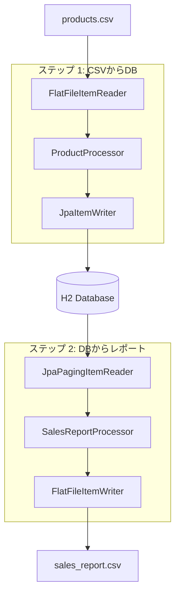
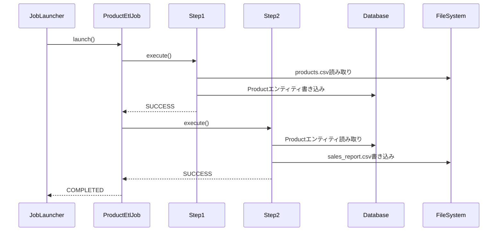

# 設計書

## 概要

この設計は、マルチステップジョブアーキテクチャを使用してSpring Batch ETLパイプラインを実装します。システムは、各ステップにItemReader、ItemProcessor、ItemWriterコンポーネントを持つ標準的なSpring Batchパターンに従います。設計は関心の分離、適切なエラーハンドリングを重視し、ファイルベースとデータベースベースの両方のバッチ処理パターンを実証します。

## アーキテクチャ

### 高レベルアーキテクチャ



### ジョブフロー



## コンポーネントとインターフェース

### データモデル

#### Productエンティティ
```java
@Entity
@Table(name = "PRODUCTS")
public class Product {
    @Id
    private Long id;
    private String name;
    private String description;
    private BigDecimal price;
    private LocalDateTime importDate;
}
```

#### SalesReport DTO
```java
public class SalesReport {
    private Long productId;
    private String productName;
    private BigDecimal price;
}
```

### ステップ1コンポーネント

#### ProductCsvReader
- **タイプ**: FlatFileItemReader<Product>
- **責任**: CSVファイルを読み取りProductオブジェクトにマッピング
- **設定**: 
  - リソース: classpath:products.csv
  - LineMapper: DelimitedLineTokenizerとBeanWrapperFieldSetMapper

#### ProductProcessor
- **タイプ**: ItemProcessor<Product, Product>
- **責任**: importDateの追加とデータ検証の実行
- **ロジック**: importDateを現在のタイムスタンプに設定、必須フィールドの検証

#### ProductWriter
- **タイプ**: JpaItemWriter<Product>
- **責任**: Productエンティティをデータベースに永続化
- **設定**: JPA操作のためのEntityManagerFactory注入

### ステップ2コンポーネント

#### ProductReader
- **タイプ**: JpaPagingItemReader<Product>
- **責任**: ページネーションを使用してデータベースからProductエンティティを読み取り
- **設定**: 
  - クエリ: "SELECT p FROM Product p ORDER BY p.id"
  - ページサイズ: 100

#### SalesReportProcessor
- **タイプ**: ItemProcessor<Product, SalesReport>
- **責任**: 価格 > 50で製品をフィルタリングしSalesReportに変換
- **ロジック**: 価格 <= 50の製品にはnullを返す（フィルタアウト）

#### SalesReportWriter
- **タイプ**: FlatFileItemWriter<SalesReport>
- **責任**: SalesReportオブジェクトをCSVファイルに書き込み
- **設定**: 
  - リソース: file:sales_report.csv
  - LineAggregator: カスタムフィールド抽出を持つDelimitedLineAggregator

### ジョブ設定

#### ProductEtlJobConfig
- **責任**: ジョブとステップのbeanを定義
- **コンポーネント**:
  - ジョブ: step1 → step2フローを持つproductEtlJob
  - ステップ1: reader、processor、writerを持つチャンク指向ステップ
  - ステップ2: reader、processor、writerを持つチャンク指向ステップ
  - チャンクサイズ: トランザクションあたり10アイテム

## データモデル

### データベーススキーマ
```sql
CREATE TABLE PRODUCTS (
    id BIGINT PRIMARY KEY,
    name VARCHAR(255) NOT NULL,
    description TEXT,
    price DECIMAL(10,2) NOT NULL,
    import_date TIMESTAMP
);
```

### CSV形式

#### 入力CSV (products.csv)
```
id,name,description,price
1,Laptop,High-performance laptop,999.99
2,Mouse,Wireless mouse,25.50
```

#### 出力CSV (sales_report.csv)
```
productId,productName,price
1,Laptop,999.99
```

## エラーハンドリング

### ステップレベルエラーハンドリング
- **スキップポリシー**: 無効なレコードをスキップしエラーをログ記録
- **リトライポリシー**: 一時的なデータベースエラーを最大3回リトライ
- **ロールバック**: チャンク失敗時のトランザクションロールバック

### ジョブレベルエラーハンドリング
- **ジョブ再開**: 最後に成功したステップからのジョブ再開をサポート
- **失敗ハンドリング**: ステップ失敗時にジョブ実行を停止
- **ログ記録**: 進行状況のINFOレベル、失敗のERRORレベルでの包括的ログ記録

### 例外シナリオ
1. **ファイルが見つからない**: 明確なエラーメッセージでジョブ失敗
2. **データベース接続**: 指数バックオフでリトライ
3. **無効なデータ**: レコードをスキップして処理を継続
4. **ディスク容量**: ジョブ失敗とクリーンアップ指示を提供

## テスト戦略

### 単体テスト
- **Readerテスト**: ファイルシステムをモック、CSV解析をテスト
- **Processorテスト**: ビジネスロジックとフィルタリングをテスト
- **Writerテスト**: データベースをモック、エンティティ永続化を検証
- **ジョブ設定テスト**: bean配線と設定をテスト

### 統合テスト
- **ステップテスト**: テストデータで完全なステップ実行をテスト
- **ジョブテスト**: 完全なジョブのエンドツーエンド実行をテスト
- **データベーステスト**: テストコンテナまたはH2で@DataJpaTestを使用
- **ファイルテスト**: ファイルI/Oテストに一時ディレクトリを使用

### テストデータ
- **products-test.csv**: 単体テスト用の小さなデータセット
- **products-large.csv**: パフォーマンステスト用の大きなデータセット
- **無効なデータシナリオ**: 不正なCSV、欠損フィールド、無効な価格

### パフォーマンステスト
- **チャンクサイズ最適化**: 異なるチャンクサイズ（10、50、100）をテスト
- **メモリ使用量**: 大きなファイル処理中のヒープ使用量を監視
- **データベースパフォーマンス**: より大きなデータセット（10K+レコード）でテスト

## 設定プロパティ

### アプリケーションプロパティ
```properties
# バッチ設定
spring.batch.job.enabled=false
spring.batch.initialize-schema=always

# データベース設定
spring.datasource.url=jdbc:h2:mem:testdb
spring.jpa.hibernate.ddl-auto=none
spring.sql.init.mode=always

# ファイル場所
batch.input.file=classpath:products.csv
batch.output.file=file:sales_report.csv
```

### バッチ設定
- **チャンクサイズ**: 10（プロパティで設定可能）
- **スレッドプール**: 簡単にするためシングルスレッド
- **トランザクションタイムアウト**: 30秒
- **スキップ制限**: ステップあたり5つの無効レコード