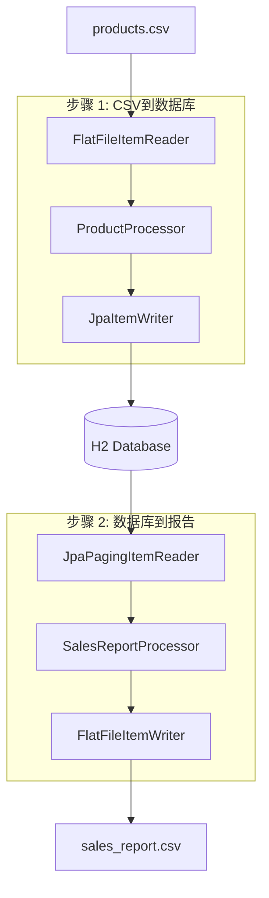
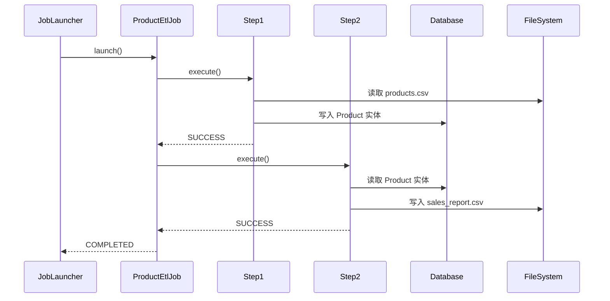

# 设计文档

## 概述

此设计使用多步骤作业架构实现Spring Batch ETL管道。系统遵循标准的Spring Batch模式，每个步骤都有ItemReader、ItemProcessor和ItemWriter组件。设计强调关注点分离、适当的错误处理，并演示基于文件和基于数据库的批处理模式。

## 架构

### 高级架构



### 作业流程



## 组件和接口

### 数据模型

#### Product 实体
```java
@Entity
@Table(name = "PRODUCTS")
public class Product {
    @Id
    private Long id;
    private String name;
    private String description;
    private BigDecimal price;
    private LocalDateTime importDate;
}
```

#### SalesReport DTO
```java
public class SalesReport {
    private Long productId;
    private String productName;
    private BigDecimal price;
}
```

### 步骤 1 组件

#### ProductCsvReader
- **类型**: FlatFileItemReader<Product>
- **职责**: 读取CSV文件并映射到Product对象
- **配置**: 
  - 资源: classpath:products.csv
  - LineMapper: DelimitedLineTokenizer与BeanWrapperFieldSetMapper

#### ProductProcessor
- **类型**: ItemProcessor<Product, Product>
- **职责**: 添加importDate并执行数据验证
- **逻辑**: 将importDate设置为当前时间戳，验证必需字段

#### ProductWriter
- **类型**: JpaItemWriter<Product>
- **职责**: 将Product实体持久化到数据库
- **配置**: EntityManagerFactory注入用于JPA操作

### 步骤 2 组件

#### ProductReader
- **类型**: JpaPagingItemReader<Product>
- **职责**: 使用分页从数据库读取Product实体
- **配置**: 
  - 查询: "SELECT p FROM Product p ORDER BY p.id"
  - 页面大小: 100

#### SalesReportProcessor
- **类型**: ItemProcessor<Product, SalesReport>
- **职责**: 按价格 > 50过滤产品并转换为SalesReport
- **逻辑**: 对价格 <= 50的产品返回null（被过滤掉）

#### SalesReportWriter
- **类型**: FlatFileItemWriter<SalesReport>
- **职责**: 将SalesReport对象写入CSV文件
- **配置**: 
  - 资源: file:sales_report.csv
  - LineAggregator: DelimitedLineAggregator与自定义字段提取

### 作业配置

#### ProductEtlJobConfig
- **职责**: 定义作业和步骤bean
- **组件**:
  - 作业: productEtlJob，步骤1 → 步骤2流程
  - 步骤1: 面向块的步骤，包含reader、processor、writer
  - 步骤2: 面向块的步骤，包含reader、processor、writer
  - 块大小: 每个事务10个项目

## 数据模型

### 数据库模式
```sql
CREATE TABLE PRODUCTS (
    id BIGINT PRIMARY KEY,
    name VARCHAR(255) NOT NULL,
    description TEXT,
    price DECIMAL(10,2) NOT NULL,
    import_date TIMESTAMP
);
```

### CSV格式

#### 输入CSV (products.csv)
```
id,name,description,price
1,Laptop,High-performance laptop,999.99
2,Mouse,Wireless mouse,25.50
```

#### 输出CSV (sales_report.csv)
```
productId,productName,price
1,Laptop,999.99
```

## 错误处理

### 步骤级错误处理
- **跳过策略**: 跳过无效记录并记录错误
- **重试策略**: 对瞬态数据库错误重试最多3次
- **回滚**: 块失败时事务回滚

### 作业级错误处理
- **作业重启**: 支持从最后成功步骤重启作业
- **失败处理**: 步骤失败时停止作业执行
- **日志记录**: INFO级别的进度综合日志，ERROR级别的失败日志

### 异常场景
1. **文件未找到**: 作业失败并提供清晰的错误消息
2. **数据库连接**: 使用指数退避重试
3. **无效数据**: 跳过记录并继续处理
4. **磁盘空间**: 作业失败并提供清理说明

## 测试策略

### 单元测试
- **Reader测试**: 模拟文件系统，测试CSV解析
- **Processor测试**: 测试业务逻辑和过滤
- **Writer测试**: 模拟数据库，验证实体持久化
- **作业配置测试**: 测试bean连接和配置

### 集成测试
- **步骤测试**: 使用测试数据测试完整步骤执行
- **作业测试**: 测试完整作业端到端执行
- **数据库测试**: 使用@DataJpaTest与测试容器或H2
- **文件测试**: 使用临时目录进行文件I/O测试

### 测试数据
- **products-test.csv**: 用于单元测试的小数据集
- **products-large.csv**: 用于性能测试的大数据集
- **无效数据场景**: 格式错误的CSV、缺失字段、无效价格

### 性能测试
- **块大小优化**: 测试不同的块大小（10、50、100）
- **内存使用**: 监控大文件处理期间的堆使用情况
- **数据库性能**: 使用更大的数据集测试（10K+记录）

## 配置属性

### 应用程序属性
```properties
# 批处理配置
spring.batch.job.enabled=false
spring.batch.initialize-schema=always

# 数据库配置
spring.datasource.url=jdbc:h2:mem:testdb
spring.jpa.hibernate.ddl-auto=none
spring.sql.init.mode=always

# 文件位置
batch.input.file=classpath:products.csv
batch.output.file=file:sales_report.csv
```

### 批处理配置
- **块大小**: 10（可通过属性配置）
- **线程池**: 单线程以简化
- **事务超时**: 30秒
- **跳过限制**: 每步骤5个无效记录