# Project Call Relationship Diagram

This document depicts the call and execution relationships of the Spring Batch job in two ways: a component dependency graph and an execution flowchart.

---

## 1. Component Dependency Graph (Text Tree)

This diagram shows the static dependency and composition relationships between the core components.

```text
JobLauncher
└── Job: productEtlJob
    ├── Listener: DetailedJobExecutionListener
    └── Flow:
        ├── Step 1: step1_loadCsvToDb
        │   ├── Reader: FlatFileItemReader (Reads from products.csv)
        │   ├── Processor: ProductProcessor (Validates & transforms Product)
        │   ├── Writer: JpaItemWriter (Writes to Database)
        │   ├── Policy: CustomSkipPolicy, CustomRetryPolicy (Error Handling)
        │   └── Listener: DetailedStepExecutionListener
        │
        └── Step 2: step2_generateReportFromDb
            ├── Reader: JpaPagingItemReader (Reads with paging from DB)
            ├── Processor: SalesReportProcessor (Filters & converts to SalesReport DTO)
            ├── Writer: FlatFileItemWriter (Writes to sales_report.csv)
            ├── Policy: CustomSkipPolicy, CustomRetryPolicy (Error Handling)
            └── Listener: DetailedStepExecutionListener
```

---

## 2. Job Execution Flowchart (Mermaid Syntax)

This diagram details the dynamic execution flow of the entire job when the application starts. You can copy the code block below into any Markdown editor that supports Mermaid (like Typora, VS Code plugins, or GitHub) to see the visual graph.

```mermaid
graph TD
    A[Start Application] --> B{Launch Job: productEtlJob};
    B --> C[beforeJob Listener];
    C --> D[Start Step 1: step1_loadCsvToDb];
    D --> E[beforeStep Listener];

    E --> F(Chunk Loop Start: size=10);
    F --> G[Read Product from CSV];
    G --> H{Process Product};
    H --> I[Write Product to DB];
    I --> J{Chunk Complete?};
    J -- No --> G;
    J -- Yes --> K[Commit Transaction];
    K --> L{All CSV lines processed?};
    L -- No --> F;
    L -- Yes --> M[End Step 1];
    
    M --> N[afterStep Listener];
    N --> O[Start Step 2: step2_generateReportFromDb];
    O --> P[beforeStep Listener];

    P --> Q(Chunk Loop Start: size=10);
    Q --> R[Read Product from DB];
    R --> S{Process & Filter Product};
    S --> T[Write SalesReport to CSV];
    T --> U{Chunk Complete?};
    U -- No --> R;
    U -- Yes --> V[Commit Transaction];
    V --> W{All DB records processed?};
    W -- No --> Q;
    W -- Yes --> X[End Step 2];

    X --> Y[afterStep Listener];
    Y --> Z[afterJob Listener];
    Z --> AA[End Application];

    %% Styling
    style A fill:#28a745,color:#fff,stroke:#28a745,stroke-width:2px
    style AA fill:#28a745,color:#fff,stroke:#28a745,stroke-width:2px
    style B fill:#007bff,color:#fff,stroke:#007bff,stroke-width:2px
    style D fill:#17a2b8,color:#fff,stroke:#17a2b8,stroke-width:2px
    style O fill:#17a2b8,color:#fff,stroke:#17a2b8,stroke-width:2px
```


