# プロジェクト呼び出し関係図

このドキュメントは、Spring Batchジョブの呼び出しと実行の関係を、コンポーネント依存図と実行フローチャートの2つの方法で描写します。

---

## 1. コンポーネント依存関係図（テキストツリー）

この図は、コアコンポーネント間の静的な依存関係と構成関係を示しています。

```text
JobLauncher
└── Job: productEtlJob
    ├── Listener: DetailedJobExecutionListener
    └── Flow:
        ├── Step 1: step1_loadCsvToDb
        │   ├── Reader: FlatFileItemReader (products.csvから読み込み)
        │   ├── Processor: ProductProcessor (Productの検証と変換)
        │   ├── Writer: JpaItemWriter (データベースへ書き込み)
        │   ├── Policy: CustomSkipPolicy, CustomRetryPolicy (エラー処理)
        │   └── Listener: DetailedStepExecutionListener
        │
        └── Step 2: step2_generateReportFromDb
            ├── Reader: JpaPagingItemReader (DBからページングで読み込み)
            ├── Processor: SalesReportProcessor (フィルタリングとSalesReport DTOへの変換)
            ├── Writer: FlatFileItemWriter (sales_report.csvへ書き込み)
            ├── Policy: CustomSkipPolicy, CustomRetryPolicy (エラー処理)
            └── Listener: DetailedStepExecutionListener
```

---

## 2. ジョブ実行フローチャート（Mermaid構文）

この図は、アプリケーションが起動した際のジョブ全体の動的な実行フローを詳細に示しています。以下のコードブロックをMermaidをサポートするMarkdownエディタ（Typora、VS Codeプラグイン、GitHubなど）にコピーすると、視覚的なグラフとして表示できます。

```mermaid
graph TD
    A[アプリケーション開始] --> B{ジョブ起動: productEtlJob};
    B --> C[beforeJob Listener];
    C --> D[Step 1 開始: step1_loadCsvToDb];
    D --> E[beforeStep Listener];

    E --> F(チャンクループ開始: サイズ=10);
    F --> G[CSVからProductを読み込み];
    G --> H{Productを処理};
    H --> I[ProductをDBに書き込み];
    I --> J{チャンク完了?};
    J -- いいえ --> G;
    J -- はい --> K[トランザクションをコミット];
    K --> L{全CSV行を処理済み?};
    L -- いいえ --> F;
    L -- はい --> M[Step 1 終了];
    
    M --> N[afterStep Listener];
    N --> O[Step 2 開始: step2_generateReportFromDb];
    O --> P[beforeStep Listener];

    P --> Q(チャンクループ開始: サイズ=10);
    Q --> R[DBからProductを読み込み];
    R --> S{Productを処理・フィルタリング};
    S --> T[SalesReportをCSVに書き込み];
    T --> U{チャンク完了?};
    U -- いいえ --> R;
    U -- はい --> V[トランザクションをコミット];
    V --> W{全DBレコードを処理済み?};
    W -- いいえ --> Q;
    W -- はい --> X[Step 2 終了];

    X --> Y[afterStep Listener];
    Y --> Z[afterJob Listener];
    Z --> AA[アプリケーション終了];

    %% Styling
    style A fill:#28a745,color:#fff,stroke:#28a745,stroke-width:2px
    style AA fill:#28a745,color:#fff,stroke:#28a745,stroke-width:2px
    style B fill:#007bff,color:#fff,stroke:#007bff,stroke-width:2px
    style D fill:#17a2b8,color:#fff,stroke:#17a2b8,stroke-width:2px
    style O fill:#17a2b8,color:#fff,stroke:#17a2b8,stroke-width:2px
```


