# 项目调用关系图

本文档使用两种方式描绘了Spring Batch作业的调用与执行关系：组件依赖图与执行流程图。

---

## 1. 组件依赖关系图 (文本树)

这张图展示了核心组件之间的静态依赖和构成关系。

```text
JobLauncher
└── Job: productEtlJob
    ├── Listener: DetailedJobExecutionListener
    └── Flow:
        ├── Step 1: step1_loadCsvToDb
        │   ├── Reader: FlatFileItemReader (从 products.csv 读取)
        │   ├── Processor: ProductProcessor (校验、转换Product)
        │   ├── Writer: JpaItemWriter (写入数据库)
        │   ├── Policy: CustomSkipPolicy, CustomRetryPolicy (错误处理)
        │   └── Listener: DetailedStepExecutionListener
        │
        └── Step 2: step2_generateReportFromDb
            ├── Reader: JpaPagingItemReader (从数据库分页读取)
            ├── Processor: SalesReportProcessor (筛选、转换为SalesReport DTO)
            ├── Writer: FlatFileItemWriter (写入 sales_report.csv)
            ├── Policy: CustomSkipPolicy, CustomRetryPolicy (错误处理)
            └── Listener: DetailedStepExecutionListener
```

---

## 2. 作业执行流程图 (Mermaid 语法)

这张图详细描述了当应用启动时，整个作业的动态执行流程。您可以将下面的代码块复制到任何支持 Mermaid 的 Markdown 编辑器中（如 Typora、VS Code 插件或 GitHub）来查看可视化图形。

```mermaid
graph TD
    A[应用启动] --> B{启动 Job: productEtlJob};
    B --> C[beforeJob Listener];
    C --> D[开始 Step 1: step1_loadCsvToDb];
    D --> E[beforeStep Listener];

    E --> F(分块循环开始: 大小=10);
    F --> G[从CSV读取Product];
    G --> H{处理Product};
    H --> I[将Product写入DB];
    I --> J{分块完成?};
    J -- 否 --> G;
    J -- 是 --> K[提交事务];
    K --> L{所有CSV行已处理?};
    L -- 否 --> F;
    L -- 是 --> M[结束 Step 1];
    
    M --> N[afterStep Listener];
    N --> O[开始 Step 2: step2_generateReportFromDb];
    O --> P[beforeStep Listener];

    P --> Q(分块循环开始: 大小=10);
    Q --> R[从DB读取Product];
    R --> S{处理并筛选Product};
    S --> T[将SalesReport写入CSV];
    T --> U{分块完成?};
    U -- 否 --> R;
    U -- 是 --> V[提交事务];
    V --> W{所有DB记录已处理?};
    W -- 否 --> Q;
    W -- 是 --> X[结束 Step 2];

    X --> Y[afterStep Listener];
    Y --> Z[afterJob Listener];
    Z --> AA[应用结束];

    %% Styling
    style A fill:#28a745,color:#fff,stroke:#28a745,stroke-width:2px
    style AA fill:#28a745,color:#fff,stroke:#28a745,stroke-width:2px
    style B fill:#007bff,color:#fff,stroke:#007bff,stroke-width:2px
    style D fill:#17a2b8,color:#fff,stroke:#17a2b8,stroke-width:2px
    style O fill:#17a2b8,color:#fff,stroke:#17a2b8,stroke-width:2px
```


